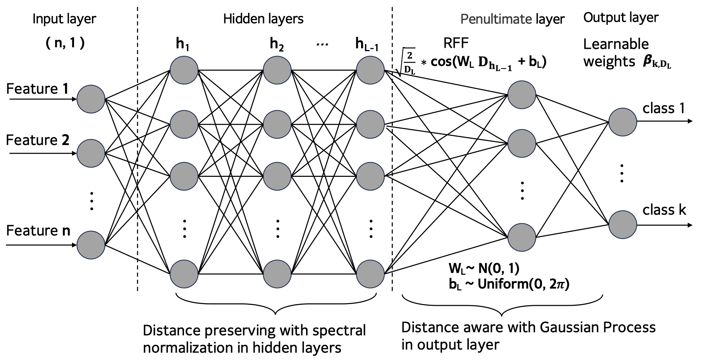
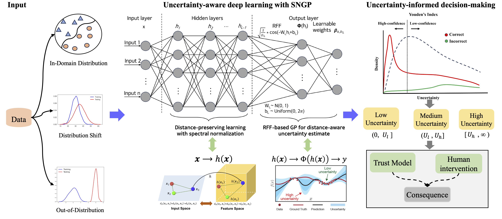

# A unified uncertainty-informed approach for risk management of deep learning models in the open world

The official implementation of the paper ["A unified uncertainty-informed approach for risk management of deep learning models in the open world"].

&nbsp;




To install requirements:
```setup
pip install -r requirements.txt
```

Run example:

The running results are automatically saved as .csv files (e.g., nn.csv, sngp.csv) in the /results directory.

If you want to train SNGP, simply add the flag (and adjust the epochs):
```setup
python train.py --sngp --epochs 20
```

If you want to train deep ensemble, simply add the flag (and adjust the  epochs):
```setup
python train.py --ensemble --epochs 10
```
